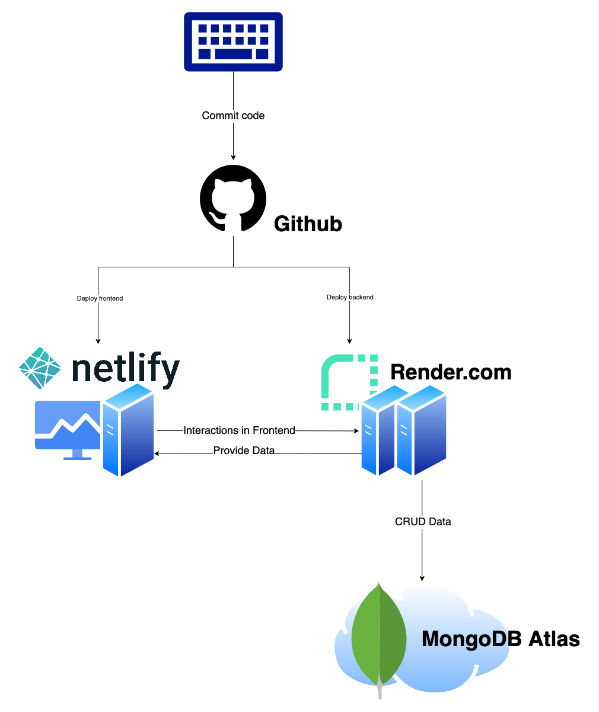

# SustainMind
[](https://forthebadge.com)
[](https://forthebadge.com)

[](https://app.netlify.com/sites/grand-fenglisu-52932d/deploys)

SustainMind is a cloud-based supply chain due diligence software that enables corporations to analyze their supply chains, to identify risks, and to jointly conduct prevention measures. The live built can be visited at: [https://www.sustainmind.de/](https://www.sustainmind.de/).


# Background

The German Supply Chain Due Diligence Act (Lieferkettensorgfaltspflichtengesetz) commits large corporations to prevent human right violations and environmental pollution in their supply chains, which includes identifying risks and conducting prevention programs for all their direct suppliers. These steps take a lot of time and need to be documented carefully. Violations can be punished with fines of up to 8 million euros or 2% of global revenue.

We have developed an all-in-one supply chain software that helps corporations affected by the German Supply Chain Due Diligence Act to comply. Our software reduces costs and temporal expenditure as well as the likelihood of fines.

Our product explanation video can be found here:

[](https://www.youtube.com/watch?v=ZDqw2COKLmg)

# Run Locally

Clone the project

```bash
  git clone https://github.com/LexT96/SustainMind.git
```

Go to the project directory

```bash
  cd SustainMind
```

## Server

Navigate to the directory

```bash
  cd server
```

Fill your credentials according to the .env

Install dependencies

```bash
  yarn
```

Seed sample data into database:

```bash
  yarn seed
```

Start the server

```bash
  yarn dev
```

## Frontend

Navigate to the directory

```bash
  cd web
```

Fill your credentials according to the .env

Install dependencies

```bash
  yarn
```

Start the server

```bash
  yarn dev
```

# Website Structure

Our website consists of the following pages:
- Landing Page (path: "."): The landing page informs new users about the advantages of our software and convinces them to register
- Dashboard (path: "/home"): Users see the an overview of the most relevant SustainMind features: My Products, My Suppliers, Supplier Marketplace, Risk Analysis, Production Sites
- Products (path: "/products"): Users can view their own products with respective ESG scores. The scores are calculated based on the ESG scores of all suppliers involved in the supply chain. In future, our users will be able to generate QR codes to prove the sustainability of their products to their customers.
- Suppliers (path: "/suppliers"): All suppliers of the current user are listed. After registration, a company has zero suppliers and adds suppliers from the SustainMind database with the "Add Supplier" button. In future, the list of suppliers can be automatically imported from ERP systems like SAP.
- Supplier Details (path: "/suppliers/<SUPPLIER_ID>"): Allows the risk scores and suggested prevention measures for a specific supplier
- Marketplace (path: "/marketplace"): The supplier marketplace lists all suppliers registered on our platform. It can be used by corporations to find new suppliers that value sustainability.
- Production Sites (path: "/sites"): Allows to add and view production sites. Information about production sites is required for the automatic risk analysis.
- Risk Analysis (path: "/analysis"): Corporations can see their own ESG score and document the identified risks and conducted prevention measures.

# Features
Feature | Implemented
:------------ | :-------------
Landing Page | ✅
Registration System | ✅
Dashboard | ✅
Supplier Marketplace | ✅
Supplier Data Collection | ✅
Risk Analysis | ✅
Suggest Prevention Measures | ✅
Conduct Prevention Measures | In Progress
Automatic Reporting | ✅
Multiple Logins per Company | Coming Soon
Certificates (with QR Codes) | Coming Soon

# Infrastructure
## TechStack
Frontend: React (Typescript)  
Backend: Express (Node)  
Database: MongoDB

## Infrastructure
- Frontend: Netlify
- Backend: Render
- Database: MongoDB Atlas




### Deployment

Pushing changes in the /web folder on the main branch will lead to a deployment on www.SustainMind.de (running on Netlify)

Pushing changes in the /server folder on the main branch will lead to a deployment on https://sustainmind.onrender.com/ (running on Render)

We use Clerk for authentication & user management

## Database Schema


## File Structure

Our project consists of the following non-exhaustiv list of files:
```
SustainMind
├── server: Contains all backend functionality
│   ├── node_modules: Dependency libraries
│   ├── public
│   │   └── risk_analysis
│   │       └── pdfs: Generated risk analysis pdf files
│   ├── src: Backend source code
│   │   ├── controllers: Files for database requests
│   │   ├── db
│   │   │   ├── esg_scoring
│   │   │   │   ├── index_loaders: Python scripts to read indices from excel/csv files into MongoDB
│   │   │   │   ├── countries.csv: Exported table with country indices
│   │   │   │   └── merge_countries_with_scores.py: Merge all indices into a single MongoDB collection
│   │   │   └── seeders: Contains files to seed test data into MongoDB
│   │   ├── models: Files to define the MongoDB schemes
│   │   ├── risk_analysis: Loads supplier information from the database, adds it to a LaTeX file compiles it as PDF
│   │   ├── routes: Routes backend requests
│   │   ├── config.ts: Database connection configuration
│   │   └── index.ts: ???
│   └── .env
├── web: Contains all frontend functionality
│   ├── node_modules: Dependency libraries
│   ├── public: Contains frontend graphics (e.g. company logos, product images)
│   ├── src: Frontend code
│   │   ├── api: Communication with backend
│   │   ├── components
│   │   │   ├── Analysis: Risk analysis components
│   │   │   ├── Marketplace: Supplier marketplace components
│   │   │   ├── Navbars: Navigation bars
│   │   │   ├── ProductionSites: Code for production site components
│   │   │   ├── Products: Product Overview code
│   │   │   ├── sections/landing: Landing page sections
│   │   │   ├── Startside: Authentication page code
│   │   │   ├── Startsides: Dashboard components
│   │   │   └── Suppliers: Supplier overview and supplier details components
│   │   ├── pages: Code for the pages (AnalysisPage, MarketplacePage, ...)
│   │   ├── react-query: ???
│   │   ├── App.css: ???
│   │   ├── App.tsx: ???
│   │   ├── config.ts: ???
│   │   ├── main.tsx
│   │   └── router.tsx: Routes user requests
│   └── .env
└──  README.md: technical documentation
```

## Appendix

[Link to Pitch Deck](https://app.pitch.com/app/presentation/a3e4d2b3-91b3-4d28-b7ad-3c9a854581c0/04592aaf-1616-4c72-b173-320963c01031)  
[Link to prototype](https://www.sustainmind.de/)

Our Team:

Florian Weiser,
Thorsten Lex,
Burhan Yesilöz and
Omar Metwally
