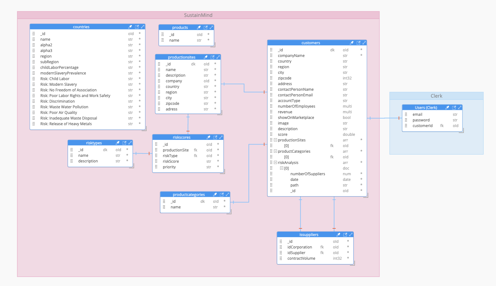

# SustainMind
[](https://forthebadge.com)
[](https://forthebadge.com)

We develop a cloud-based supply chain software that enables corporations to analyze their supply chains, to identify risks, and to jointly conduct prevention measures
([Link to landingpage](https://www.sustainmind.de/)).


## Deployment Status
[](https://app.netlify.com/sites/grand-fenglisu-52932d/deploys)

## Marketing Video

[](https://www.youtube.com/watch?v=ZDqw2COKLmg)

## Demo Video

[](https://www.youtube.com/watch?v=CXnRSlJv0Ls)


## Pitch Deck

[Link to Pitch Deck](https://app.pitch.com/app/presentation/a3e4d2b3-91b3-4d28-b7ad-3c9a854581c0/04592aaf-1616-4c72-b173-320963c01031)
## Prototype

[Link to prototype](https://www.sustainmind.de/)
## Background

In the summer semester of 2023, our team participated in a significant challenge aimed at addressing a pressing issue in the business world. The challenge focused on empowering small and middle-sized enterprises (SMEs) to navigate the complex landscape of Environmental, Social, and Governance (ESG) regulations. This challenge presented an opportunity to develop a solution that could revolutionize how SMEs approach sustainability and responsible business practices.

Our team, consisting of students from various disciplines, was excited to take on this task and create a meaningful impact. We named our software solution "SustainMind" - a cloud-based supply chain software designed to help corporations analyze their supply chains, identify risks, and collaborate on implementing ESG compliance measures.
## What added value do we deliver?

| Value Propositions | Explanation     | 
| :-------- | :------- |
| Save Time | Juggle no more with daunting heaps of data from countless suppliers. Our solution does the heavy lifting for you, streamlining collection and analysis, liberating you from time-consuming processes, and freeing up countless hours. Now you can focus on what really matters: scaling your business and driving innovation.| 
| Reduce Legal Costs | Why let avoidable legal costs eat into your profits? Our tool empowers you to slash these expenditures. We equip you with the strategies and resources needed to sidestep potential legal landmines, ensuring a financially healthy business future. | 
| Avoid Penalties | The sting of non-compliance with laws like LkSG can be brutal, with penalties reaching an eye-watering 8 million € or 2% of yearly gross income. But fear no more! Our tool ensures your business practices stay within the legal bounds, thereby saving you from potential financial catastrophe. | 
| Clear ToDos, Less Uncertainty | Say goodbye to tedious training sessions and laborious documentation. Our tool is the epitome of user-friendliness, offering clear, intuitive action points to navigate through your ESG commitments. No confusion, no uncertainties, only crystal-clear direction to steer your enterprise towards sustainable growth. | 
## Prototype

[Link to prototype](https://www.sustainmind.de/)

## Competitor Analysis

A lot of companies currently use excel tables to identify risks and to manage prevention measures, which is very time consuming and error prone. Existing software solutions for supply chain compliance are often only targeted towards larger companies. Our software, on the other hand, also targets medium sized companies. Furthermore, we are the only company that allows collaboration with other companies who have the same suppliers to jointly conduct prevention measures and to share costs. We furthermore generate sustainability certificates to prove supply chain sustainability to customers.

|  | SustainMind     |  Excel Table| Compliance Solutions | EcoVadis | Workive | Risk Cloud ESG software |AutidBoard | 
| :-------- | :------- | :------- |  :------- | :------- | :------- | :------- | :------- |
| Automated Reporting | yes | no| yes  | yes | yes | yes | yes | 
| Own Risk Analysis| yes |yes | yes | yes | yes |  yes|  yes| 
| Supplier Risk Analysis | yes |yes |yes  | yes  | no |  no| no | 
| Targeted towards | Meidum sized and large companies  |Meidum sized and large companies  | only large corporations | only large corporations |only large corporations|  only large corporations| only large corporations | 
| Collaboration possible | yes |no |no  | no  | no |  no| no | 
| Sustainability certificates | yes |no |no  | no  | no |  no| no | 


## Pricing

Our Sustainmind pricing model offers flexibility and scalability to meet the different needs of companies. The basic fee is 40,000 euros and already includes 100 suppliers. In addition, we offer a discount to small companies to help them get started.For an additional 50 suppliers beyond the included 100, there is a fee of 15,000 euros. This allows companies to expand their supplier network and extend a comprehensive risk analysis to a larger number of partners. In addition, we offer the option of an on-site audit, where we review various items to ensure that all relevant specifications and standards are met. We charge a separate fee of 500 euros for this audit. It ensures that companies receive a thorough review and can further strengthen their compliance efforts.

## Run Locally

Clone the project

```bash
  git clone https://github.com/LexT96/SustainMind.git
```

Go to the project directory

```bash
  cd SustainMind
```

### Server

Navigate to the directory

```bash
  cd server
```

Fill your credentials according to the .env.example

Install dependencies

```bash
  yarn
```

Start the server

```bash
  yarn dev
```

### Frontend

Navigate to the directory

```bash
  cd web
```

Fill your credentials according to the .env.example

Install dependencies

```bash
  yarn
```

Start the server

```bash
  yarn dev
```

## TechStack
Frontend: React (Typescript)
Backend: Express (Node)
Database: MongoDB

## Infrastructure
- Frontend: Netlify
- Backend: Render
- Database: MongoDB Atlas

### Deployment

Pushing changes in the /web folder on the main branch will lead to a deployment on www.SustainMind.de (running on Netlify)

Pushing changes in the /server folder on the main branch will lead to a deployment on https://sustainmind.onrender.com/ (running on Render)

We use Clerk for authentication & user management

## Database Schema


## Appendix

Our Team:

Florian Weißer,
Thorsten Lex,
Burhan Yesilöz und
Omar Metwally
